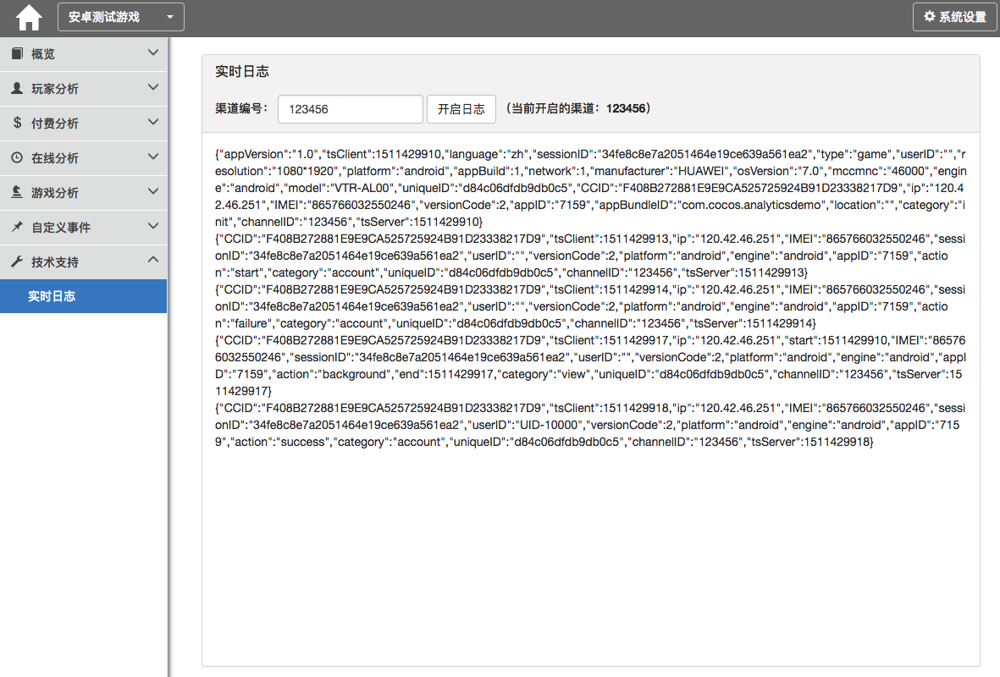

# 集成调试

在SDK集成的过程中，可以使用SDK初始化中填写的channelID在统计系统中开启实时日志调试。  
开启后即可实时查看接入统计SDK的游戏中发出的日志详情。

实时日志
---

验证实时日志的准确性
---

为了确保集成正确，请务必在真机中进行数据测试：

- 确保SDK初始化参数AppID、AppSecret和ChannelID填写正确
- 确保游戏具备必要的权限
- 确保测试机的网络畅通