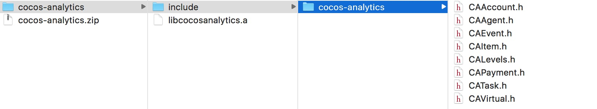
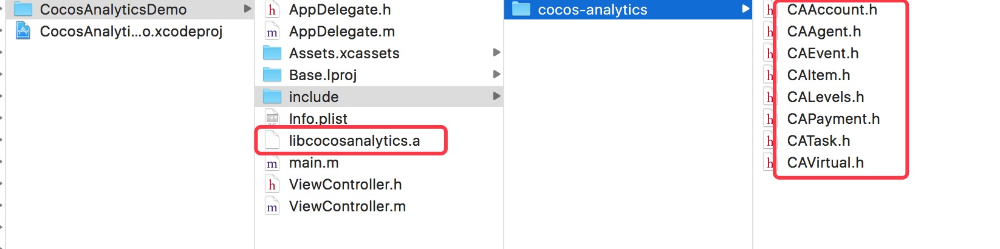
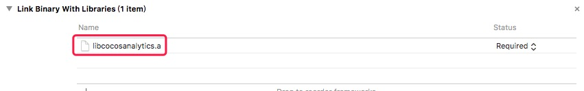

# iOS SDK 接入文档

## 导入 SDK
下载 SDK 后解压后得到如下文件：

将里面的内容拷贝到目标工程：

添加引用库： 

## SDK 初始化
当前 SDK 仅提供代码方式的初始化，接口如下：

```
...
#import "include/cocos-analytics/CAAgent.h"
...
[CAAgent init:@"YOUR_CHANNELID" appID:@"YOUR_APPID" appSecret:@"YOUR_SECRET"];
```

请在AppDelegate的didFinishLaunchingWithOptions处调用初始化接口。

在游戏前后台切换时分别调用 onPause 和 onResume，在结束游戏时调用 onDestroy：

```
- (void)applicationDidEnterBackground:(UIApplication *)application {
    [CAAgent onPause];
}

- (void)applicationWillEnterForeground:(UIApplication *)application {
    [CAAgent onResume];
}

- (void)applicationWillTerminate:(UIApplication *)application {
    [CAAgent onDestroy];
}

```

## 本地调试
SDK 还提供了 CAAgent::enableDebug(boolean) 来开启/关闭本地日志的输出。调试成功后，请置为 False 或者移除此方法。

## 玩家登录
CAAccount 提供了用户相关的接口定义

```
// 开始登陆
+ (void)loginStart

// 登陆成功
+ (void)loginSuccess:(NSString *)uid

// 登陆失败
+ (void)loginFailed

// 退出登陆
+ (void)logout
```

### 玩家信息
CAAccount 还包含玩家信息相关的接口定义：

```

[CAAccount setAge:20];
[CAAccount setGender:CAAccount.MALE];
[CAAccount setAccountType:@"VIP1"];
[CAAccount setLevel:1];
[CAAccount createRole:@"roleID"
                 userName:@"roleName"
                     race:@"人族"
                roleClass:@"法师"
                gameServer:@"一区"];
```

### 关卡统计
CALevels 作为关卡统计模块，提供了如下接口：

```
+ (void)begin:(NSString*)level;
+ (void)complete:(NSString*)level;
+ (void)failed:(NSString*)level reason:(NSString*)reason;
```

### 任务统计
CATask 作为任务统计模块，提供如下接口：

```
+ (void)begin:(NSString*)taskID taskType:(int)taskType;
+ (void)complete:(NSString*)taskID;
+ (void)failed:(NSString*)taskID reason:(NSString*)reason;
```

TaskType 的定义如下


| 常量 | 说明 |
| --- | --- |
| CATask.GuideLine | 新手任务 |
| CATask.MainLine | 主线任务 |
| CATask.BranchLine | 分支任务 |
| CATask.Daily | 日常任务 |
| CATask.Activity | 活动任务 |
| CATask.Other | 其它任务，默认值 |

### 道具统计
CAItem 为道具统计模块，提供如下接口：

```
// virtualCoin 购买道具花费了多少虚拟币
// virtualType 花费的虚拟币类型
+ (void)buy:(NSString*)itemID type:(NSString*)itemType count:(int)itemCount virtualCoin:(int)virtualCoin
virtualType:(NSString*)virtualType consumePoint:(NSString*)consumePoint;

// 获得道具，包含数量和原因
+ (void)get:(NSString*)itemID type:(NSString*)itemType count:(int)itemCount reason:(NSString*)reason;

// 消耗道具，包含数量和原因
+ (void)consume:(NSString*)itemID type:(NSString*)itemType count:(int)itemCount reason:(NSString*)reason;
```

### 虚拟币统计
CAVirtual 作为虚拟币统计模块：

```
// 设置虚拟币存量
+ (void)setVirtualNum:(NSString*)type count:(long)count;

// 获得虚拟币，包含数量和原因
+ (void)get:(NSString*)type count:(long)count reason:(NSString*)reason;

// 消耗虚拟币，包含数量和原因
+ (void)consume:(NSString*)type count:(long)count reason:(NSString*)reason;
```

### 付费行为分析
CAPeiment 记录真实付费行为的发生

```
+ (void)peiBegin:(int)amount orderID:(NSString*)orderID peiType:(NSString*)peiType pppID:(NSString*)pppID currencyType:(NSString*)currencyType;
+ (void)peiSuccess:(int)amount orderID:(NSString*)orderID peiType:(NSString*)peiType pppID:(NSString*)pppID currencyType:(NSString*)currencyType;
+ (void)peiFailed:(int)amount orderID:(NSString*)orderID peiType:(NSString*)peiType pppID:(NSString*)pppID currencyType:(NSString*)currencyType;
+ (void)peiCanceled:(int)amount orderID:(NSString*)orderID peiType:(NSString*)peiType pppID:(NSString*)pppID currencyType:(NSString*)currencyType;
```

peiType 为支付途径：信用卡、支付宝什么的，currencyType 为币种：RMB、USD 等，amount 单位为分。

### 自定义事件统计
CAEvent 接口定义：

```
+ (void)onEvent:(NSString*)eventName;
+ (void)onEventStart:(NSString*)eventName;
+ (void)onEventEnd:(NSString*)eventName;
```


